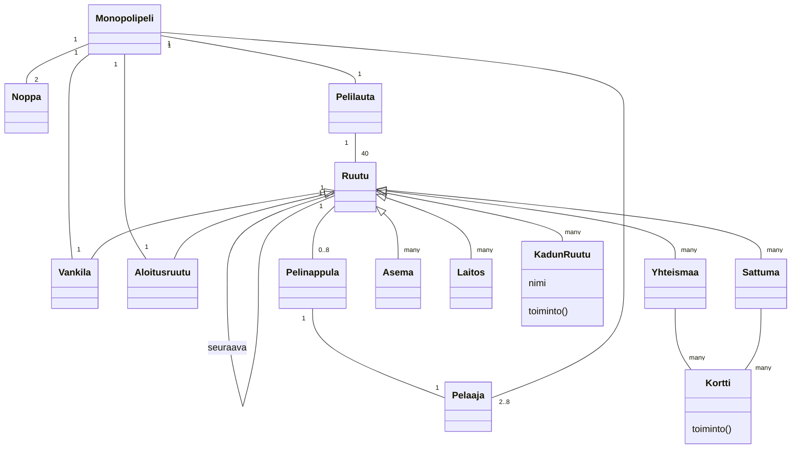

```mermaid
classDiagram
    Monopolipeli "1" -- "2" Noppa
    Monopolipeli "1" -- "1" Pelilauta
    Monopolipeli "1" -- "1" Vankila
    Monopolipeli "1" -- "1" Aloitusruutu
    Pelilauta "1" -- "40" Ruutu
    Ruutu "1" -- "1" Ruutu : seuraava
    Ruutu "1" -- "0..8" Pelinappula
    Pelinappula "1" -- "1" Pelaaja
    Pelaaja "2..8" -- "1" Monopolipeli
    Ruutu <|-- Aloitusruutu
    Ruutu <|-- Vankila
    Ruutu <|-- "many" Sattuma
    Ruutu <|-- "many" Yhteismaa
    Ruutu <|-- "many" Asema
    Ruutu <|--  "many" Laitos
    Ruutu <|-- "many" KadunRuutu
    Yhteismaa -- "many" Kortti
    Sattuma -- "many" Kortti
    class KadunRuutu{
        nimi
        toiminto()
    }
    class Kortti{
        toiminto()
    }

```
