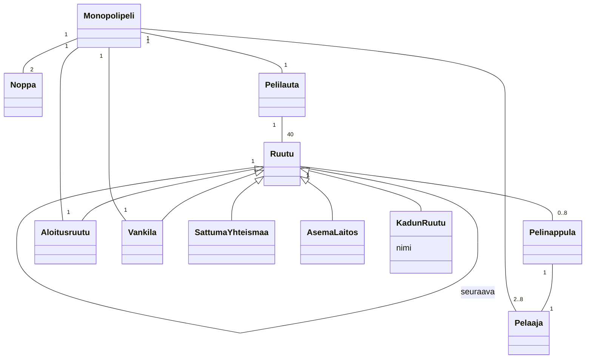

```mermaid
classDiagram
    Monopolipeli "1" -- "2" Noppa
    Monopolipeli "1" -- "1" Pelilauta
    Pelilauta "1" -- "40" Ruutu
    Ruutu "1" -- "1" Ruutu : seuraava
    Ruutu "1" -- "0..8" Pelinappula
    Pelinappula "1" -- "1" Pelaaja
    Pelaaja "2..8" -- "1" Monopolipeli
    Ruutu <|-- Aloitusruutu
    Ruutu <|-- Vankila
    Ruutu <|-- SattumaYhteismaa
    Ruutu <|-- AsemaLaitos
    Ruutu <|-- KadunRuutu
    Monopolipeli "1" -- "1" Vankila
    Monopolipeli "1" -- "1" Aloitusruutu
    class KadunRuutu{
        nimi
    }

```
