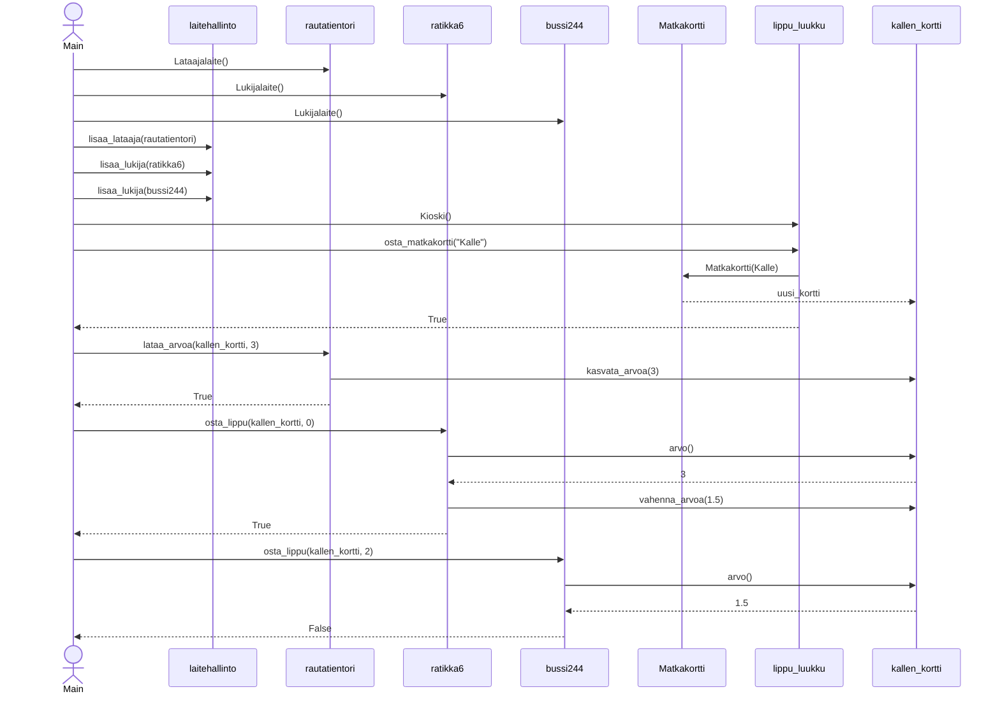

```mermaid
sequenceDiagram
  actor Main
  participant laitehallinto
  participant rautatientori
  participant ratikka6
  participant bussi244
  participant Matkakortti
  
  Main ->> rautatientori : Lataajalaite()
  Main ->> ratikka6: Lukijalaite()
  Main ->> bussi244: Lukijalaite()

  Main ->> laitehallinto : lisaa_lataaja(rautatientori)
  Main ->> laitehallinto : lisaa_lukija(ratikka6)
  Main ->> laitehallinto : lisaa_lukija(bussi244)

  Main ->> lippu_luukku : Kioski()
  Main ->> lippu_luukku : osta_matkakortti("Kalle")
  lippu_luukku ->> Matkakortti : Matkakortti(Kalle)
  Matkakortti -->> kallen_kortti : uusi_kortti
  lippu_luukku -->> Main : True

  Main ->> rautatientori : lataa_arvoa(kallen_kortti, 3)
  rautatientori ->> kallen_kortti : kasvata_arvoa(3)
  rautatientori -->> Main : True

  Main ->> ratikka6 : osta_lippu(kallen_kortti, 0)
  ratikka6 ->> kallen_kortti : arvo()
  kallen_kortti -->> ratikka6 : 3
  ratikka6 ->> kallen_kortti : vahenna_arvoa(1.5)
  ratikka6 -->> Main : True

  Main ->> bussi244 : osta_lippu(kallen_kortti, 2)
  bussi244 ->> kallen_kortti : arvo()
  kallen_kortti -->> bussi244 : 1.5
  bussi244 -->> Main : False
  
  
  
  

  
  

 
```
