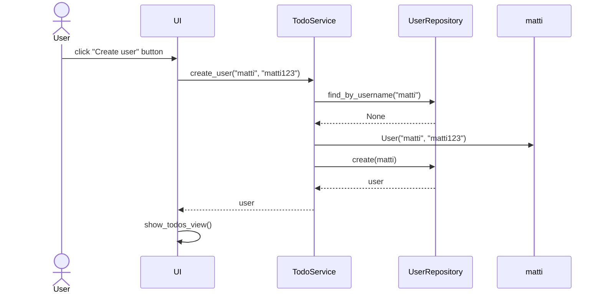

```mermaid
sequenceDiagram
  actor User
  participant UI
  participant TodoService
  participant UserRepository
  participant matti
  User->>UI: click "Create user" button
  UI->>TodoService: create_user("matti", "matti123")
  TodoService->>UserRepository: find_by_username("matti")
  UserRepository-->>TodoService: None
  TodoService->>matti: User("matti", "matti123")
  TodoService->>UserRepository: create(matti)
  UserRepository-->>TodoService: user
  TodoService-->>UI: user
  UI->>UI: show_todos_view()
```
