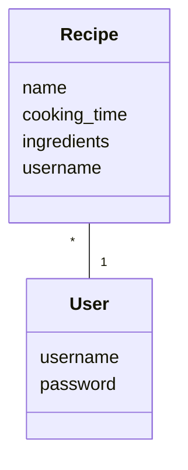

# Architecture description

## Structure
Functionally distinct parts of the architecture are divided into a three-layer packaging structure shown below:


The **UI** package takes care of the user interface, **services** of the application logic, and **repositories** of the fetching and storage of data. Additionally, the **entities** package contains the classes *User* and *Recipe*, which define the relevant data items.

## User interface
The UI consists of 9 views:
- login
- register
- home
- my recipes
   - add recipe
   - edit recipe
- find recipes
  - search results
  - recipe details
    
The user interface (UI) of the application is structured into 9 distinct views, each implemented as its own class. Each view class is responsible for rendering the respective page's layout and handling user interactions within that page. By organizing the UI into separate classes, the codebase remains modular and easy to maintain, with a clear separation of concerns between different parts of the application. By the principle of separation of concerns, all logic is handled by calling methods contained in the *RecipeAppService* class.


## Application logic
The classes *User* and *Recipe* represent the user and recipe objects, which correspond to the contents of database tables:


All functions initiated by the user are managed by the **RecipeAppService** class. Some methods provided by the class are:

```bash
register_user(self, username, password)
```

```bash
login(self, username, password)
```

```bash
get_current_user(self)
```

```bash
create_recipe(self, name, ingredients, time, username)
```

```bash
search_recipes_algorithm(self, name, ingredients, max_time, username)
```
RecipeAppService works as an interface between the UI and the repository classes.


## Data storage
The classes *RecipeRepository* and *UserRepository* of the **repositories** package handle the database interactions. Both classes handle data using an SQLite database.

Both users and recipes are stored in their respective database tables users and recipes. The database tables are initialized using the initialize_database.py file.

## Main functionalities

### Sequence diagram for login
```mermaid
sequenceDiagram
  actor User
  participant UI
  participant RecipeAppService
  participant UserRepository
  User ->> UI : Login button pressed
  UI ->> RecipeAppService : login("admin", "1234")
  RecipeAppService ->> UserRepository : find_by_username("admin")
  UserRepository ->> RecipeAppService : User
  RecipeAppService ->> UI : User
  UI ->> UI : _show_home_view()


